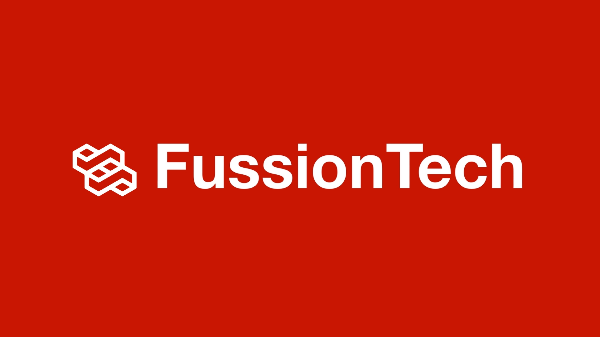

# FussionTech 🚀

## Transformando ideas en realidad digital 💡

### ¿Quiénes Somos? 🤔
Somos **FussionTech**, una casa desarrolladora de software dedicada a transformar ideas en soluciones digitales innovadoras y personalizadas. Nuestra misión es mejorar la gestión de clientes y la centralización de ofertas y eventos, ofreciendo tecnología avanzada y soporte excepcional. Nos comprometemos a impulsar el éxito y la sostenibilidad de nuestros clientes, fomentando un entorno de trabajo inclusivo y creativo.

### Misión 🎯
Desarrollar soluciones de software innovadoras y personalizadas para mejorar la gestión de clientes y la centralización de ofertas y eventos, aumentando así la eficiencia. Nos comprometemos a ofrecer tecnología avanzada, soporte excepcional y resultados de alta calidad que satisfagan las necesidades de nuestros clientes.

### Visión 🔭
Ser líderes en innovación tecnológica, transformando ideas en soluciones de software que impulsen el éxito y la sostenibilidad de nuestros clientes, al tiempo que fomentamos un entorno de trabajo inclusivo y creativo para nuestros empleados.

### Nuestro Equipo 👥

#### SCRUM Master y Product Owners 🏆
- **Sara Valentina Sierra** - SCRUM Master
- **Gianluca Gramegna** - Product Owner
- **Juan Francisco Ramírez** - Product Owner
- **Juan Fernando Jaimes** - Product Owner

#### DevOps y QA Testers 🛠️
- **Camilo Alejandro Nossa** - DevOps
- **Diego Alejandro Pardo** - DevOps
- **Esteban Salazar** - DevOps
- **Carlos Santiago Rojas** - QA Tester
- **Stiven Ortiz** - QA Tester

#### Equipo de Desarrollo 💻
- **Javier Alejandro Moyano** - Desarrollador
- **Kevin Jaimes** - Desarrollador

---

### ¡Contáctanos! 📞
- **Email:** fussiontech.devhouse@gmail.com

---

### Conéctate con nosotros 🌐

---
